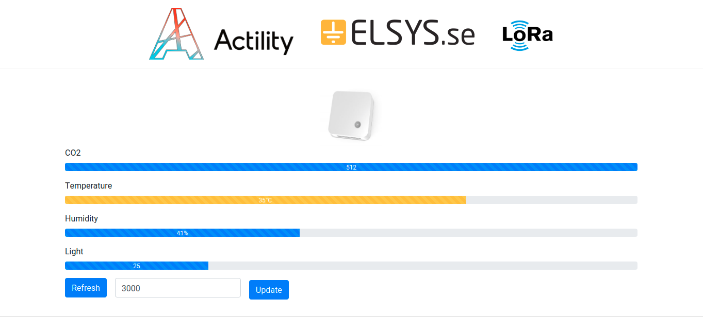

# elsysmon

> A Elsys Device Monitoring Page

## Preview



## Build Setup

``` bash
# clone project
git clone  https://github.com/maclarensg/elsysmon.git
cd elsysmon
# install dependencies
npm install

# serve with hot reload at localhost:8080
npm run dev

# build for production with minification
npm run build
```
_For detailed explanation on how things work, consult the [docs for vue-loader](http://vuejs.github.io/vue-loader)._


## License

This project is licensed under the terms of the MIT license.
